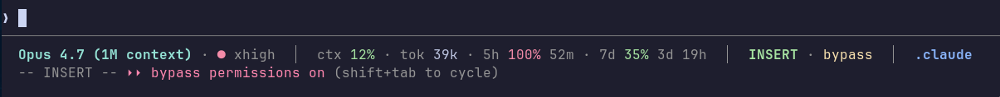

# claude-statusline-bar

A polished, information-dense status line for [Claude Code](https://docs.claude.com/en/docs/claude-code) — with logical grouping, ANSI styling, and zero dependencies beyond `bash`, `jq`, and `git`.



```
Opus 4.7 (1M context) · ● xhigh  │  ctx 12% · tok 39k · 5h 100% 52m · 7d 35% 3d 19h  │  INSERT · bypass  │  .claude
```

## What it shows

Four logical groups, separated by `│`:

| Group | Contents | Example |
|---|---|---|
| **AI state** | Model name, effort level dot | `Sonnet 4.6 · ● xhigh` |
| **Usage metrics** | Context %, session tokens, 5h & 7d rate limits + countdown | `ctx 12% · tok 60k · 5h 35% 4h 23m · 7d 62% 3d` |
| **Session mode** | Vim mode, permission mode | `INSERT · bypass` |
| **Workspace** | Current folder, git branch, changes, behind-remote | `.claude  main ~3 ↓2` |

### Color ramps

- **Green → Yellow → Red** on context & rate-limit percentages (thresholds at 50% / 80%)
- **Effort level** colored by intensity (xhigh=red, high=yellow, medium=white)
- **Git status** — green `✓` clean, yellow `~N` dirty, red `↓N` behind remote

Empty groups (e.g. no git repo, no rate-limit data) are skipped silently.

## Requirements

- `bash` (any recent version)
- `jq` — for parsing Claude Code's JSON input
- `git` — optional, only needed for git segment
- `awk`, `date` — standard on macOS and Linux

Claude Pro/Max subscriptions get the `5h` and `7d` rate-limit segments. API-key-only users skip those automatically.

## Install

### One-liner

```bash
curl -fsSL https://raw.githubusercontent.com/arielonoriaga/claude-statusline-bar/main/install.sh | bash
```

### Manual

1. Clone or download `statusline.sh` somewhere:

   ```bash
   mkdir -p ~/.claude
   curl -fsSL https://raw.githubusercontent.com/arielonoriaga/claude-statusline-bar/main/statusline.sh \
     -o ~/.claude/statusline.sh
   chmod +x ~/.claude/statusline.sh
   ```

2. Register it in `~/.claude/settings.json`:

   ```json
   {
     "statusLine": {
       "type": "command",
       "command": "bash ~/.claude/statusline.sh"
     }
   }
   ```

3. Restart Claude Code.

## Configuration

The script reads two optional fields from your `settings.json`:

| Key | Effect |
|---|---|
| `effortLevel` | Shown as `● low` / `● medium` / `● high` / `● xhigh` |
| `skipDangerousModePermissionPrompt` | Adds `bypass` to the session-mode group when `true` |

Custom config location? Set `CLAUDE_CONFIG_DIR` and the script will pick it up.

## Customization

Edit `statusline.sh` directly — it's intentionally ~250 lines of readable bash. Common tweaks:

- **Change separators** — edit `GROUP_SEP` / `ITEM_SEP` near the top
- **Change color thresholds** — edit `pct_color()` (50/80 by default)
- **Reorder groups** — edit the final `groups=(...)` array
- **Add/remove segments** — each group builds an `items` array; add or remove freely

## How it works

Claude Code invokes the statusline command on every render and pipes a JSON payload to stdin. The script reads fields like `.model.display_name`, `.context_window.used_percentage`, `.rate_limits.five_hour.*`, `.workspace.current_dir`, etc., and composes a single colored ANSI line.

For reference, fields the script currently reads:

```
.model.display_name
.context_window.used_percentage
.context_window.total_input_tokens
.context_window.total_output_tokens
.rate_limits.five_hour.used_percentage
.rate_limits.five_hour.resets_at
.rate_limits.seven_day.used_percentage
.rate_limits.seven_day.resets_at
.vim.mode
.output_style.name
.workspace.current_dir
.workspace.project_dir
```

## License

[MIT](LICENSE) © Ariel Onoriaga
